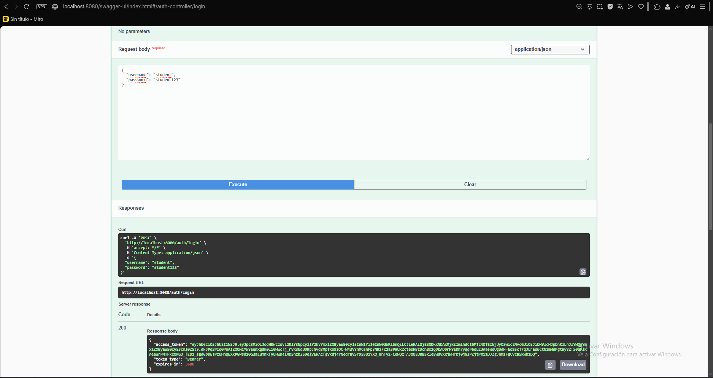
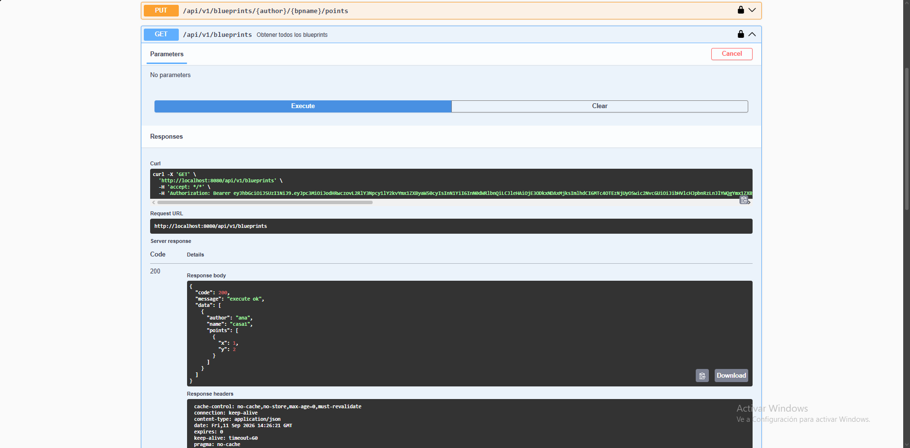
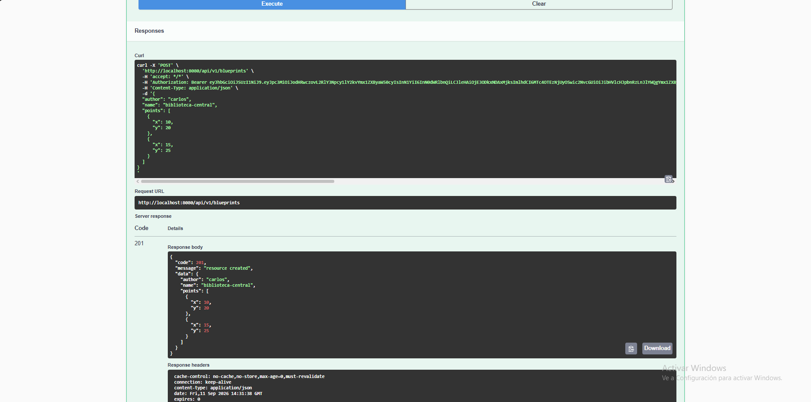
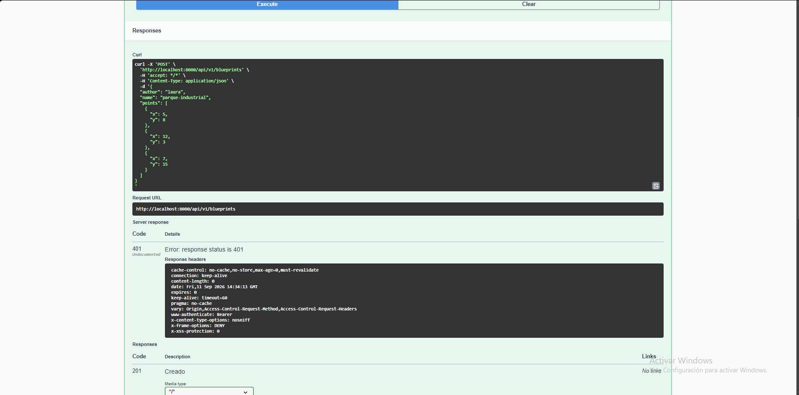
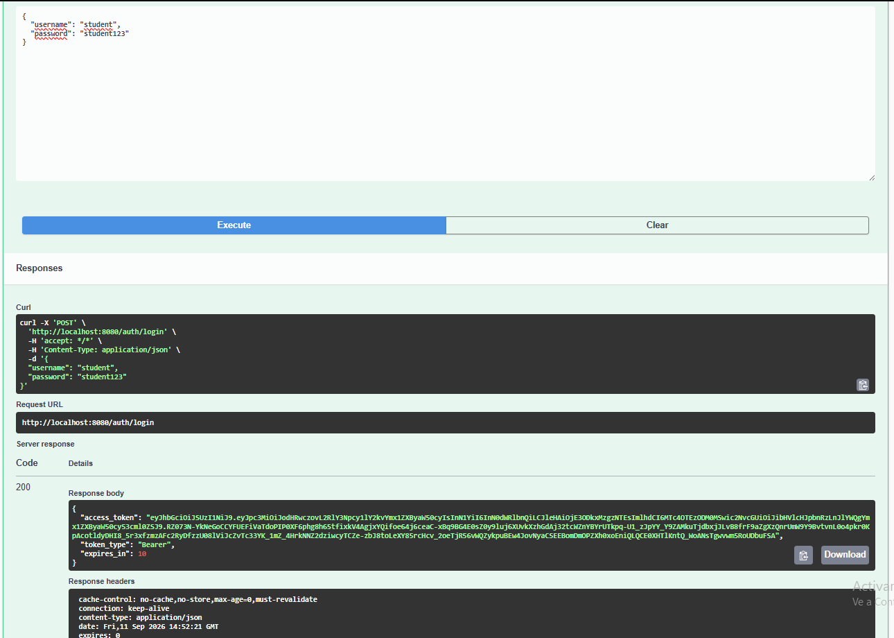
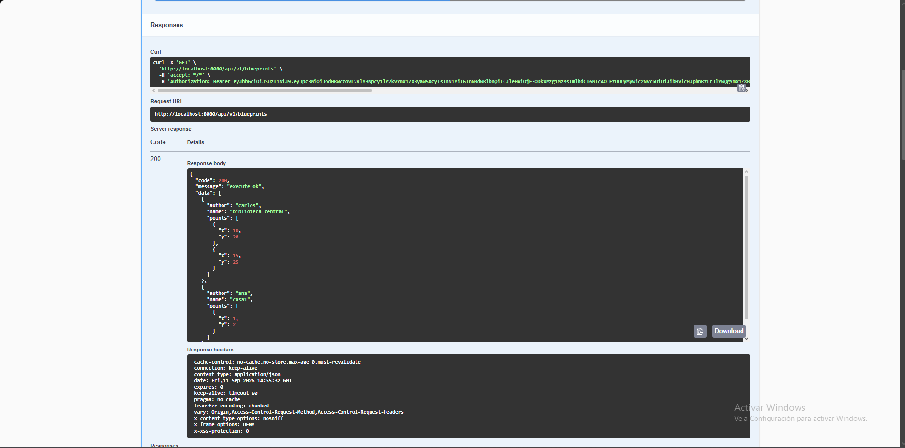
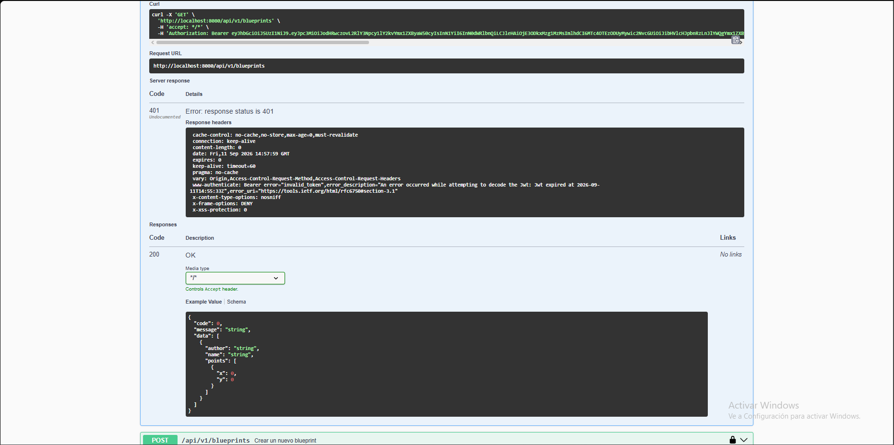
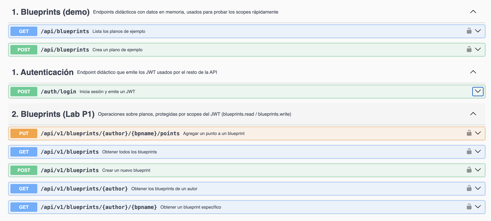
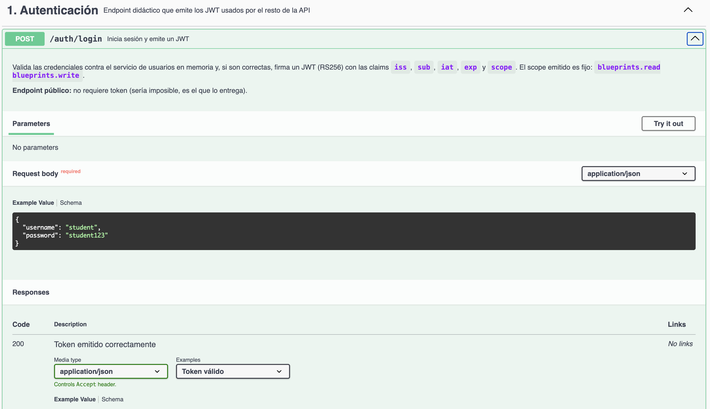
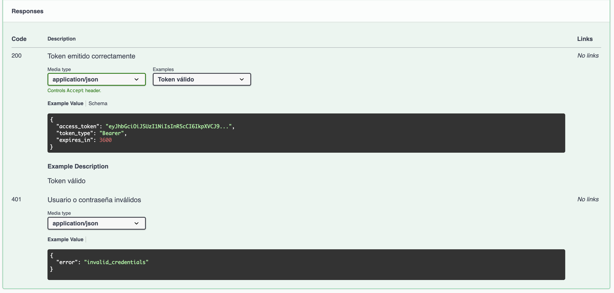

# Escuela Colombiana de Ingeniería Julio Garavito
## Arquitectura de Software – ARSW
### Laboratorio – Parte 2: BluePrints API con Seguridad JWT (OAuth 2.0)

Este laboratorio extiende la **Parte 1** ([Lab_P1_BluePrints_Java21_API](https://github.com/DECSIS-ECI/Lab_P1_BluePrints_Java21_API)) agregando **seguridad a la API** usando **Spring Boot 3, Java 21 y JWT (OAuth 2.0)**.  
El API se convierte en un **Resource Server** protegido por tokens Bearer firmados con **RS256**.  
Incluye un endpoint didáctico `/auth/login` que emite el token para facilitar las pruebas.

---

## Objetivos
- Implementar seguridad en servicios REST usando **OAuth2 Resource Server**.
- Configurar emisión y validación de **JWT**.
- Proteger endpoints con **roles y scopes** (`blueprints.read`, `blueprints.write`).
- Integrar la documentación de seguridad en **Swagger/OpenAPI**.

---

## Requisitos
- JDK 21
- Maven 3.9+
- Git

---

## Ejecución del proyecto
1. Clonar o descomprimir el proyecto:
   ```bash
   git clone https://github.com/DECSIS-ECI/Lab_P2_BluePrints_Java21_API_Security_JWT.git
   cd Lab_P2_BluePrints_Java21_API_Security_JWT
   ```
   ó si el profesor entrega el `.zip`, descomprimirlo y entrar en la carpeta.

2. Ejecutar con Maven:
   ```bash
   mvn -q -DskipTests spring-boot:run
   ```

3. Verificar que la aplicación levante en `http://localhost:8080`.

---

## Endpoints principales

### 1. Login (emite token)
```
POST http://localhost:8080/auth/login
Content-Type: application/json

{
  "username": "student",
  "password": "student123"
}
```
Respuesta:
```json
{
  "access_token": "eyJhbGciOiJSUzI1NiIsInR5cCI6IkpXVCJ9...",
  "token_type": "Bearer",
  "expires_in": 3600
}
```

### 2. Consultar blueprints (requiere scope `blueprints.read`)
```
GET http://localhost:8080/api/blueprints
Authorization: Bearer <ACCESS_TOKEN>
```

### 3. Crear blueprint (requiere scope `blueprints.write`)
```
POST http://localhost:8080/api/blueprints
Authorization: Bearer <ACCESS_TOKEN>
Content-Type: application/json

{
  "name": "Nuevo Plano"
}
```

---

## Swagger UI
- URL: [http://localhost:8080/swagger-ui/index.html](http://localhost:8080/swagger-ui/index.html)
- Pulsa **Authorize**, ingresa el token en el formato:
  ```
  Bearer eyJhbGciOi...
  ```

---

## Estructura del proyecto
```
src/main/java/co/edu/eci/blueprints/
  ├── api/BlueprintController.java       # Endpoints protegidos
  ├── auth/AuthController.java           # Login didáctico para emitir tokens
  ├── config/OpenApiConfig.java          # Configuración Swagger + JWT
  └── security/
       ├── SecurityConfig.java
       ├── MethodSecurityConfig.java
       ├── JwtKeyProvider.java
       ├── InMemoryUserService.java
       └── RsaKeyProperties.java
src/main/resources/
  └── application.yml
```

---

## Actividades propuestas
1. Revisar el código de configuración de seguridad (`SecurityConfig`) e identificar cómo se definen los endpoints públicos y protegidos.

- Endpoints públicos: se marcan las rutas de login y las de documentación (Swagger) como accesibles sin token, porque justo para pedir el token no puedes tenerlo aún, y la documentación debe poder verse libremente.

- Endpoints protegidos por scope: todo lo que es parte de la API de negocio exige que el token traiga uno de los permisos de lectura o escritura definidos. Estos permisos no se configuran a mano en la seguridad: se generan automáticamente a partir de lo que el token dice que el usuario puede hacer (su "scope"), con un prefijo estándar que Spring agrega solo.

- Regla por defecto: cualquier ruta que no esté explícitamente clasificada igual exige estar autenticado, aunque sin pedir un permiso específico.

- Validación del token: se activa el modo de "servidor de recursos", que intercepta las peticiones, revisa el token que viene en la cabecera, lo valida contra la clave pública correspondiente y, si es válido, le asigna al usuario los permisos que traía ese token para que las reglas anteriores puedan aplicarse.

2. Explorar el flujo de login y analizar las claims del JWT emitido.

Flujo:

- El cliente envía usuario y contraseña al endpoint de login.
- Se valida esa credencial contra un servicio de usuarios en memoria (contraseñas guardadas ya hasheadas, no en texto plano).
- Si es válida, se arma el conjunto de claims del token y se firma con la clave privada RSA que la app genera al arrancar.
- Se responde con el token, su tipo (Bearer) y cuánto dura.

Claims que trae el token emitido:

- iss (issuer): identifica quién emitió el token, tomado de la configuración de la app.
- sub (subject): el usuario que inició sesión.
- iat / exp: momento de emisión y momento de expiración (el TTL también viene de configuración).
- scope: los permisos que tiene ese usuario, en este caso, tanto lectura como escritura de blueprints se le asignan de forma fija a cualquiera que haga login, sin distinguir por usuario.

3. Extender los scopes (`blueprints.read`, `blueprints.write`) para controlar otros endpoints de la API, del laboratorio P1 trabajado.

- Se le agrego @PreAuthorize a los endpoints del controlador del Lab P1 (/api/v1/blueprints/**), que antes solo dependía de la regla genérica de SecurityConfig. Ahora los GET exigen scope de lectura y el POST (crear plano) y el PUT de puntos exigen scope de escritura.

- Pruebas con autorización







- Pruebas sin autorización




4. Modificar el tiempo de expiración del token y observar el efecto.

- Se modifico el tiempo a 10 segundos



- Se verifica que durante esos 10 segundos si funciona el token 



- Se vuelve a verificar luego de los 10 segundos y ya no funcionaya que el token ya expiro.



- En conclusión el exp del JWT define su validez de forma autocontenida, sin depender del servidor ni del cliente. Con un TTL corto se comprobó en segundos cómo el mismo token pasa de 200 a 401 solo por el paso del tiempo. Esto confirma el modelo stateless de JWT y por qué el TTL es un balance entre seguridad y usabilidad.

5. Documentar en Swagger los endpoints de autenticación y de negocio.

- Se configuró en `OpenApiConfig` un bean `OpenAPI` con un `SecurityScheme` de tipo
  HTTP Bearer y formato JWT (`bearer-jwt`), aplicado como requisito de seguridad
  global mediante `addSecurityItem`. Esto hace que en Swagger UI aparezca el botón
  **Authorize** y que cada operación protegida muestre el candado.

- El endpoint `POST /auth/login` se documentó con `@Operation`, ejemplos de
  petición/respuesta y sus dos posibles códigos de estado (`200` con el token,
  `401` si las credenciales son inválidas). No requiere autenticación previa,
  ya que es el propio endpoint que la otorga.

- Los controladores de negocio se documentaron por separado:
  - `BlueprintController` (`/api/blueprints`), el controlador de ejemplo con
    datos en memoria, agrupado bajo el tag **"1. Blueprints (demo)"**.
  - `BlueprintsAPIController` (`/api/v1/blueprints`), el controlador real del
    Lab P1, agrupado bajo el tag **"2. Blueprints (Lab P1)"**.

  En ambos, cada operación indica en su descripción el scope que exige
  (`blueprints.read` o `blueprints.write`) y sus `@ApiResponses` distinguen
  explícitamente el `401` (token ausente/expirado) del `403` (token válido
  pero sin el scope necesario) — la misma diferencia comprobada en las
  pruebas de las actividades 3 y 4.

- También se documentaron los DTOs (`ApiResponse`, `NewBlueprintRequest`,
  `Blueprint`, `Point`) con `@Schema` y ejemplos, de modo que Swagger muestra
  la forma real del cuerpo de cada petición y respuesta, no solo un objeto
  genérico.





---

## Lecturas recomendadas
- [Spring Security Reference – OAuth2 Resource Server](https://docs.spring.io/spring-security/reference/servlet/oauth2/resource-server/index.html)
- [Spring Boot – Securing Web Applications](https://spring.io/guides/gs/securing-web/)
- [JSON Web Tokens – jwt.io](https://jwt.io/introduction)

---

## Licencia
Proyecto educativo con fines académicos – Escuela Colombiana de Ingeniería Julio Garavito.
